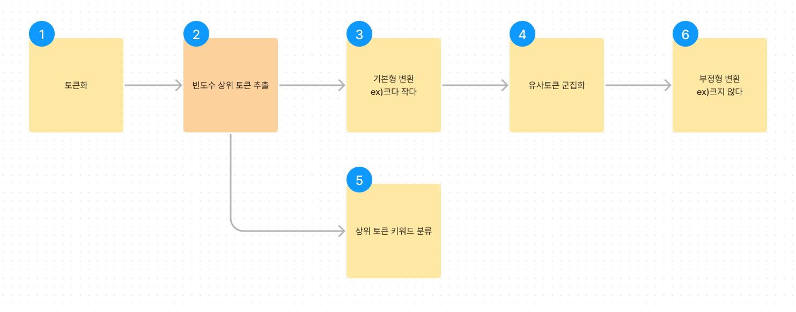
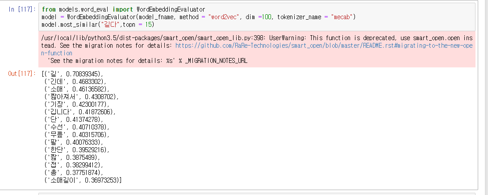
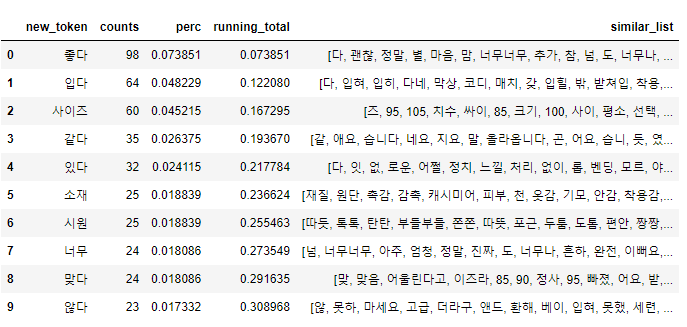
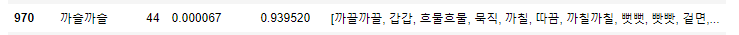
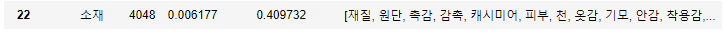
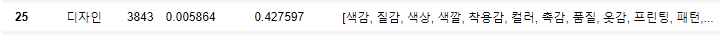
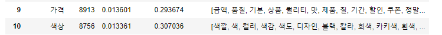
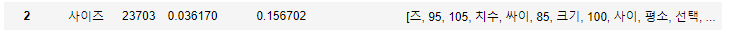

# RAG

## langchain
파이프라인  
chat  
agent  
memory  
생성 테스트  
RAG : [https://python.langchain.com/docs/use_cases/question_answering/]  

## 임베딩 모델 선택
**허깅페이스모델  
klue/roberta-small : [[klue/roberta-small](https://huggingface.co/klue/roberta-small)]  
kt믿음 : [[KT-AI/midm-bitext-S-7B-inst-v1](https://huggingface.co/KT-AI/midm-bitext-S-7B-inst-v1)]  

**오픈ai 모델  
text-embedding-ada-002 : [링크](https://platform.openai.com/docs/guides/embeddings/what-are-embeddings)

## 임베딩 활용  
워드클라우드 전처리  

### 대시보드 tokens table 전처리 개선

- 대시보드 개선을 위해 추가된 수작업이 많음
- 특히 빈도수 상위 토큰의 키워드 분류는 불가피함
- 자동화되지 않은 프로세스로 인한 **수작업을 줄이기 위한 작업**



1️⃣**토큰화**

- 토크나이저 선택
    1. 지도 konlpy mecab 라이브러리 사용 중
        1. 유저 단어사전 추가가능 > 항상 새로운 단어는 추가해야 함
        2. 속도가 빠름
        3. 품사 매칭까지 적용됨
        4. 정확도가 다소 떨어짐
            
            ```jsx
            '옷', '은', '이쁘', '지만', '구김', '이', '너무', '잘', '생겨요'
            ```
            
            ```jsx
            '옷', '은', '이쁘지만', '구김', '이', '너무', '잘', '생겨요’
            ```
            
            ```jsx
            '옷', '은', '이쁘', '지만', '구김', '이', '너무', '잘', '생기', '어요’
            ```
            
    2. 비지도 sentencepiece 고려(학습이 필요함, 품사 매칭이 안됨, 많이 빠름)
        1. BPE
            1. 새로운 단어의 추가 없이 빈도기반 자동으로 단어사전 형성
            2. 예시 : abaa,  abcd, dcdf > Aaa , Acd, dcdf
            
            ```jsx
            '▁옷은', '▁이쁘지만', '▁구김이', '▁너무', '▁잘', '▁생겨요’
            ```
            
        2. wordpiece - 확률기반
            
            ```jsx
            '옷은', '이쁘지만', '구김이', '너무', '잘', '생겨요’
            ```
            
    3. 프리트레인 토크나이저 skt kogpt2 tokenizer 학습
        1. sentencepiece 기반 토크나이저라서 bpe와 결과가 비슷함
            
            ```jsx
            # 학습 전
            '▁옷은', '▁이', '쁘', '지만', '▁구', '김', '이', '▁너무', '▁잘', '▁생겨', '요'
            
            # 학습 후
            '▁옷은', '▁이쁘지만', '▁구김이', '▁너무', '▁잘', '▁생겨요’
            ```
            
            기본 토크나이저에서 토큰화한 결과와 리뷰 학습 후 토크나이저의 토큰화 결과차이가 확연
            

2️⃣**빈도수 상위 토큰 추출**

- 명사 1자는 제거
- 토큰 중 명사, 용언 중 빈도수 상위 토큰 추출
    - top p = 90% : 빈도수 누적 확률 90%,
    - top k = 1,000  : top p 90% 단어수가 1,000개 이상일 경우

3️⃣**기본형 변환 > 토크나이저에 따라 적용 방법이 다름**

- 용언 한 두 글자는 끝에  형용사 ‘~다‘, ~~동사 ~하다’~~를 붙임
    
    꼬꼬마가 기본형 변환에 가장 알맞다
    

4️⃣**유사토큰(용언) 군집화**

- 단어기반 임베딩 활용
    1. word2vec
        
        
        
        유사단어 외의 단어도 매칭되는 문제가 있음 (정확도의 임계값이 필요함)
        
        임베딩 모델은 길다와 짧다는 길이를 중심으로 매우 인접한 단어라고 결과를 출력하는 경향이 있음 (문장 기반 임베딩 모델 openai나 roberta도 동일함)
        
        ‘어떤 명사가 많이 사용했나’를 확인할 수 있다 > `길다` 기장, 무릎, 팔, 소매
        
        토큰 테이블에서 빈도수 상위 최종 출력 형태의 토큰의 유사 토큰 추출 top_15
        
        ‘다’ 가 붙지 않은 토큰화 기본 상태가 매칭되어 나중에 품사와 기본형 변환 토큰의 매칭이 필요
        
        정확도 개선을 위한 학습데이터 정리가 필요할 듯  
        
        
        
        
        
        
        
        
        
        
        
        
        

5️⃣**상위 토큰 키워드 분류**

- 파인튠 모델 활용
    1. roberta

6️⃣**부정형 변환**

- 자동화 방안 모색 중


## 리트리버
문서 추출  
텍스트 스플리터    

## 벡터 DB
파인콘  
faiss  
elestic search  

## 인덱스 생성
저장  

## RAG 활용
기존 konlpy mecab 토크나이저를 활용한 워드클라우드를 개선하기 위해 아래와 같은 방법을 시도하였습니다.  
- 명사만 형태소 추출한다. 대시보드 워드클라우드에도 명사만 노출  
- 주요명사에 인접한 ‘동사’형용사’ 단어는 chatGPT로 생성  
- 명사+동사 문장을 이용하여 임베딩 유사 리뷰 검색 집계  

하이라이트에 키워드가 중복되는 부분을 개선하기 위해 빈도수가 높은 토큰을 키워드 분류 및 직관적인 메세지 전달을 위한 문장 생성하고  
생성된 문장을 집계하기 위해 실시간 유사도 검색하여 집계하는 방법을 구현했습니다.  

  

1. 모든 리뷰를 임베딩모델에 넣어 벡터로 변환 > 문장 생성 시 랭체인 메모리 활용  
2. 빈도수 높은 명사 추출 후 메모리 활용하여 문장 생성  
3. 생성된 문장도 벡터로 변환 및 키워드 분류  
4. 마지막으로 대시보드에서 선택한 생성 문장에 유사한 리뷰 검색하여 집계  


### 전처리 테이블 생성
빈도수 높은 명사를 추출하는 과정입니다.
```python
from preprocessing import review_tag, re90

review_tag(in_path,out_path,date)
re90(in_path,out_path)
```

### 임베딩 생성
오픈ai 임베딩 모델의 api 결과를 받아 faiss 인덱스를 저장하는 과정입니다.
```python
from review_embedding import Review_Embedding

review_embedding = Review_Embedding(out_path)
review_embedding.create_dataset(out_path)
review_embedding.create_index(index_path)
```

### 문장 생성
랭체인 메모리 활용 코드입니다.  
```python
from sentence_create import Create_Sentence

nn = pd.read_csv(out_path+"re90.csv")
text = nn['token'][0]
template="""
1.당신은 명사 다음에 올 동사나 형용사를 구하는 ai입니다.

2.최종 대표적인 동사, 형용사 최대 4개를 추출합니다.

3.형용사나 동사는 '다'로 끝나는 형태로 출력합니다.
예시
짧은, 짧아서 > 짧다
길어서, 긴 > 길다

4.답변은 단답형으로 합니다.
예시
입력: 길이
출력: 짧다,길다
"""
human_template="다음 명사 다음 단어를 구해줘, {text}"

create_sentence = Create_Sentence(index_path,"faiss0",template,human_template)
create_sentence.create_rag(text)
```

### 키워드 분류
단순 원샷 러닝 생성입니다.  
```python
from sentence_create import Create_Sentence

text = "예뻐요"
template="""
1.당신은 키워드를 분류하는 ai입니다.

2.키워드 14개이고, 다음과 같습니다.
'가격','기능성','길이','디자인','라인(핏)','마감처리','배송','사이즈','색상','소재','스타일','신축성','착용감','품질'

3.가장 유사한 의미를 나타내는 키워드로 분류합니다.
예시
몸에 맞다 > 라인(핏)
바지 길다 > 길이

4.답변은 단답형으로 합니다.
예시
입력: 옷이 이뻐요
출력: 디자인
"""
human_template="다음 문장을 분류해줘, {text}"

create_sentence = Create_Sentence(index_path,"faiss0",template,human_template)
create_sentence.create(text)
```

### 유사도 검색
인접한 k개의 유사한 결과를 추출합니다.
자카드 유사도 임계값은 0.3으로 설정했습니다.
```python
from final_output import Search

search = Search(index_path,"faiss0")
txt = "디자인이 예뻐요"
search.search(10,0.3,txt)
```
